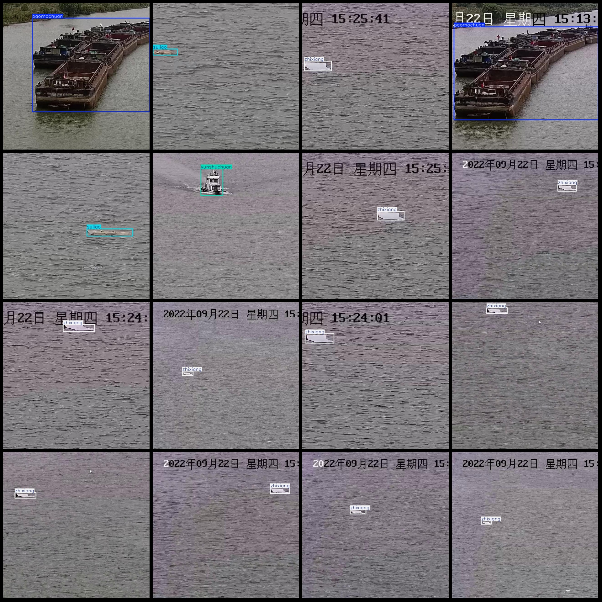
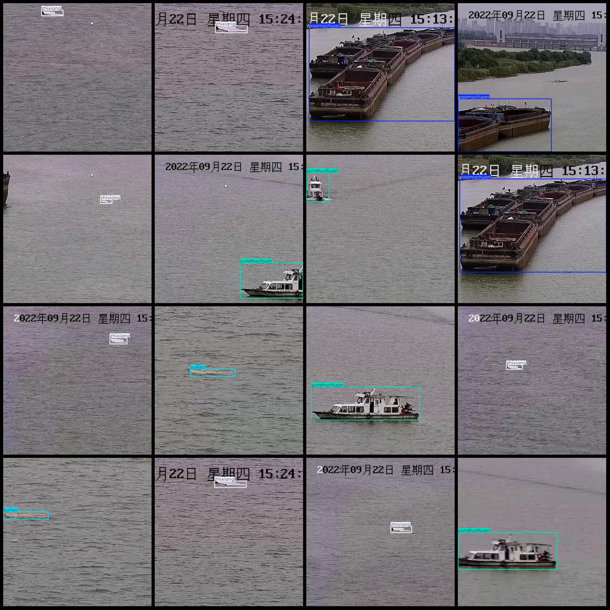

# Sea Transport Ship Foam Boat and Plastic Waste Floating Objects Detection Data Set VOC+YOLO Format with 608 Images in 4 Categories

Dataset format: Pascal VOC format + YOLO format (without split path in txtfile, only include jpgimage and corresponding VOC format xmlfile and yolo format txtfile)
number of images: 608  
annotation count: 608  
annotation count: 608  
annotationnumber of classes: 4  
Annotation class names (Note that the order of yolo formatclass does not correspond to this, and is based on the labels file with classes.txt): ["paomochuan", "suliao", "yunshuchuan", "zhixiang"]
boxes per class:   
Paomochuan (foam boat) box count = 89
Suliao (plastic waste floating objects) box count = 80
Yunshuchuan (transport vessel) box count = 139
Zhixiang (cardboard waste floating objects) box count = 300
total boxes: 608  
images per class:   
Paomochuan (Foam Ship) images = 89  
Suliao (Plastic Waste Floating Objects) images = 80  
Yunshuchuan (Transport Ship) images = 139  
Zhixiang (Cardboard Waste Floating Objects) images = 300
image resolution: 640x640  
Annotation tool: labelImg  
Annotation rules: Draw rectangles around classes  
Important notes: The dataset does not have a division into training, validation, and test sets; you need to manually divide it.  
Special statement: This dataset does not guarantee the accuracy of the trained model or weight file.  
Image preview:
## Images

Here is a pay link on Stripe ( https://buy.stripe.com/3cs8yP7sY87d0vu9AB ). Please contact me lonlonago@foxmail.com after funding $89, and I will send you a complete data files , thank you!

